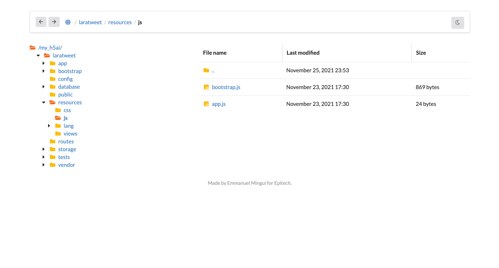
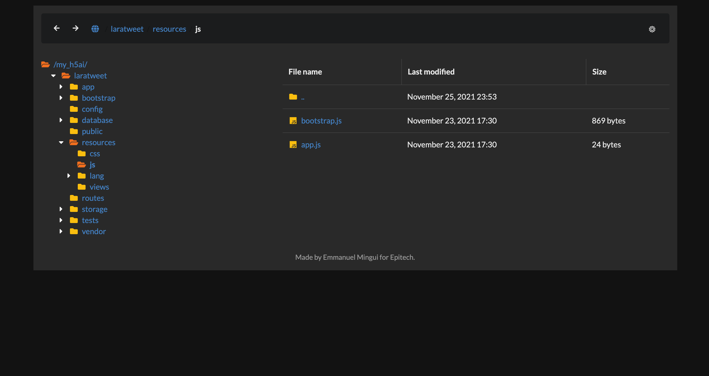

# my_h5ai
Indexeur de serveur web

## Exigences
- Compositeur gestionnaire de paquets PHP (https://getcomposer.org)

## Installation
- Placez le script avec tous ses fichiers et son dossier dans un repertoire (ou la racine) de votre serveur web.
- Ouvrez votre terminal dans ce même dossier et lancez la commande
Scenario en coquille
composer install --no-dev
```
- Cela permettra d'installer les dependances requises par le script pour fonctionner.
- Ouvrez votre serveur web au chemin d'acces contenant le script
# h5_ai
```

##Template du projet avec en exemple l'indexation d'un projet


